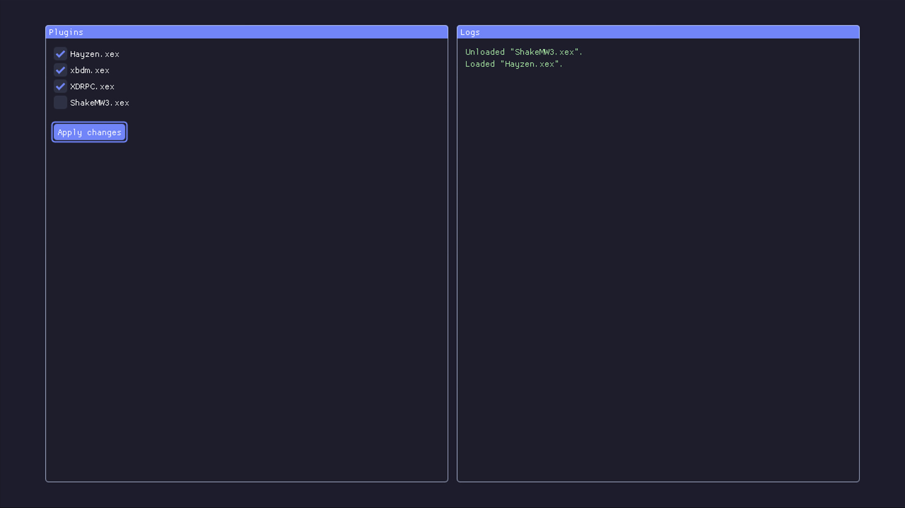

# X360PluginManager

Utility app to load and unload plugins from an Xbox 360.

<p align="center"></p>

> [!NOTE]
> This app is primarly for people using the [Bad Update exploit](https://github.com/grimdoomer/Xbox360BadUpdate) who can't load plugins via Dashlaunch (as of March 22nd 2025). If Dashlaunch becomes available for the [Bad Update exploit](https://github.com/grimdoomer/Xbox360BadUpdate), please use that instead.

## Installation

-   Download the latest build from the [releases](https://github.com/ClementDreptin/X360PluginManager/releases).
-   Unzip `X360PluginManager.zip` somewhere.
-   Modify `X360PluginManager\config.ini` to your needs.
-   Move the `X360PluginManager` directory to your console.
-   Launch `X360PluginManager\default.xex`.

## How to use `config.ini`?

The file has the following format:

```ini
[load]
plugin1 = hdd:\path\to\plugin1.xex
plugin2 = usb:\path\to\plugin2.xex
plugin3 =
plugin4 =
plugin5 =

[unload]
plugin1 = hdd:\path\to\plugin3.xex
plugin2 =
plugin3 =
plugin4 =
plugin5 =
```

Pretty self explanatory, the plugins under `[load]` will be loaded and the ones under `[unload]` will be unloaded. You can put the same plugin in both `[load]` and `[unload]` to reload it.

It's safe to specify a plugin that isn't already loaded in `[unload]`, it will just be skipped. It's also safe to specify a wrong path, it will also be skipped.

Plugins can either be loaded from the hard drive using the `hdd:` device name, or from the first USB device using the `usb:` device name.

## Building

Clone the repository and the submodule:

```
git clone --recursive https://github.com/ClementDreptin/X360PluginManager.git
```

### Requirements

-   Having the Xbox 360 Software Development Kit (XDK) installed.

### Visual Studio 2010

Open `X360PluginManager.sln` in Visual Studio.

> [!NOTE]
> Using Visual Studio 2010 is the only way to run X360PluginManager in a debugger (sadly).

### Visual Studio 2022 (or any environment)

You can't build with the 64-bit version of MSBuild so you'll need to run the 32-bit version manually. Open PowerShell (which can be done in `View > Terminal` in Visual Studio) and run the following command:

```PS1
# Create an alias to the 32-bit version of MSBuild named msbuild
# The default installation path of VS2022 is C:\Program Files\Microsoft Visual Studio\2022\Community
Set-Alias msbuild "<path_vs2022>\MSBuild\Current\Bin\MSBuild.exe"
```

To debug X360PluginManager, you need to build and run the debugger from Visual Studio 2010.

To build X360PluginManager in release mode, deploy it to the console and launch it there, start a release build, either through the Visual Studio interface or with the following command:

```PS1
msbuild /p:Configuration=Release
```
